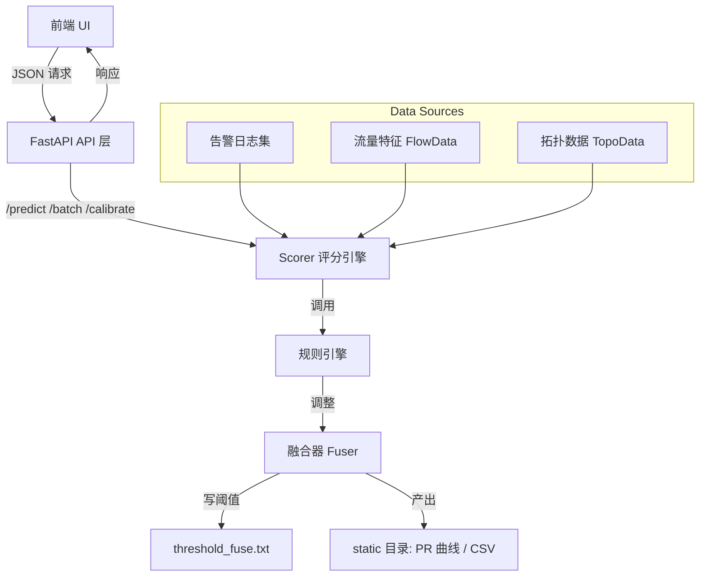
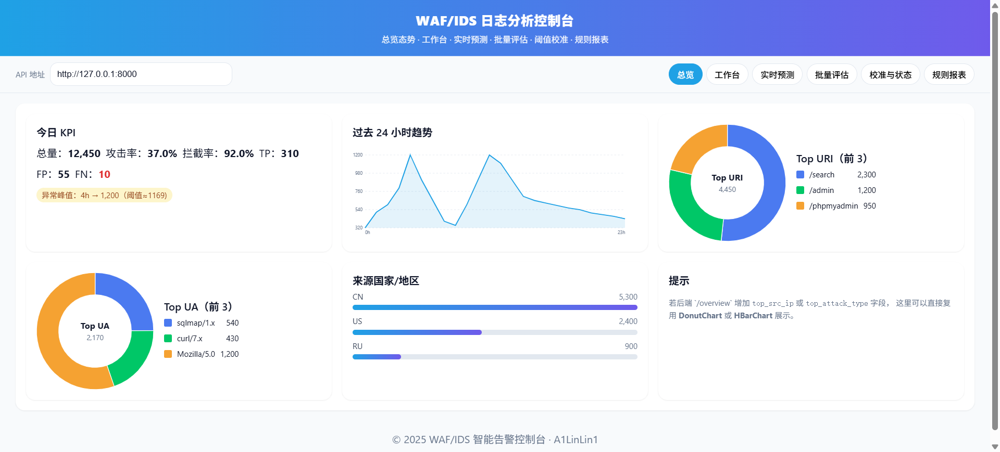
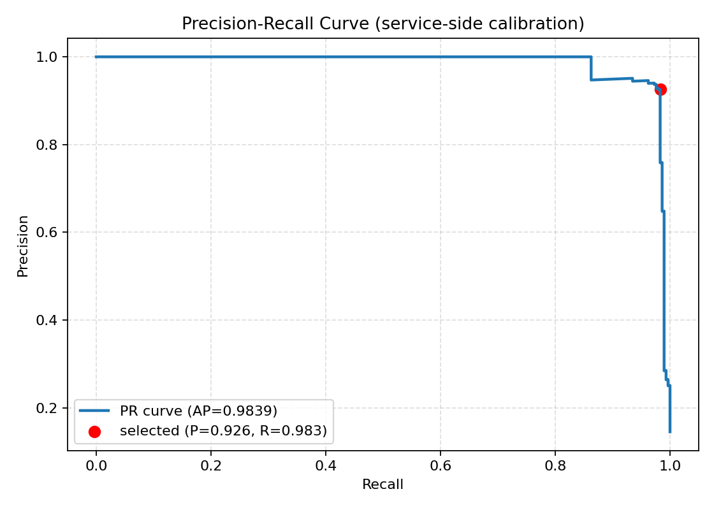

# 🛡️ AegisSense

### Intelligent WAF/IDS Log Noise-Reduction & Security Alert Analysis Console

> **AegisSense** 是一个融合机器学习与规则引擎的智能告警分析控制台，
> 旨在为 WAF/IDS 系统提供“低误报、可解释、可校准”的安全日志降噪与可视化能力。

---

## 🌍 项目概览

| 模块           | 说明                                                                                  |
| ------------ | ----------------------------------------------------------------------------------- |
| `backend/`   | FastAPI 后端服务（模型打分、批量预测、阈值校准、趋势分析）                                                   |
| `frontend/`  | React + TypeScript 前端控制台（在线预测、批量评估、PR曲线、可视化）                                        |
| `scorer.py`  | 智能降噪引擎：融合 ML 模型 + 规则系统 + 流量与拓扑感知                                                    |
| `api.py`     | FastAPI 主服务：提供 `/predict`, `/batch_predict`, `/calibrate`, `/meta`, `/overview` 等接口 |
| `static/`    | 存放校准生成的 `pr_curve_api.png`、`pr_points_api.csv` 等产物                                  |
| `rules.yaml` | 可扩展规则配置（响应关键字、UA黑名单、低危降权、重复抑制等）                                                     |

---

## 🧩 系统架构



---

## ⚙️ 快速部署

### 环境要求

* Python ≥ 3.10
* Node.js ≥ 18.0
* 推荐操作系统：Linux / macOS / Windows 10+

### 安装依赖

```bash
# 后端依赖
pip install -r requirements.txt

# 前端依赖
cd frontend
npm install
```

### 启动服务

```bash
# 启动 FastAPI 后端
python api.py
# 默认端口 http://127.0.0.1:8000

# 启动前端开发服务器
cd frontend
npm run dev
# 访问 http://localhost:5173
```

---

## 🚀 功能模块

| 模块               | 描述                                             |
| ---------------- | ---------------------------------------------- |
| **单条预测**         | 通过 `/predict` 实时分析单条日志，输出攻击概率、规则命中与关键词解释       |
| **批量预测**         | `/batch_predict` 支持 JSONL 文件批量评估，输出汇总统计        |
| **模型校准**         | `/calibrate` 自动计算 PR 曲线并更新最优阈值，生成 PNG 与 CSV 结果 |
| **模型状态查询**       | `/meta` 返回融合器加载状态、当前阈值、最近一次标定参数                |
| **Dashboard 概览** | 展示过去24小时趋势、Top URI/UA、攻击率波动等图表                 |

---

## 📈 示例可视化

### 模型结构与逻辑流程


### 前端界面预览



### PR 曲线样例



---

## 🧠 核心原理

AegisSense 采用“三层融合模型”实现日志判定：

1. **TF-IDF + LR 模型层**：提取文本特征，输出基础攻击概率。
2. **规则修正层**：根据规则库动态调整置信度（如低危降权、探测UA、重复日志抑制）。
3. **融合器层 (Fuser)**：整合多维特征（语义、规则、流量、拓扑），进行最终打分。

---

## 📊 Dashboard 总览功能

| 区域                  | 功能              |
| ------------------- | --------------- |
| 📅 24小时趋势图          | 展示攻击与误报比例变化趋势   |
| 🧭 Top URI / Top UA | 扇形图展示攻击源热点      |
| 🌎 国家/地区分布          | 柱状图展示来源地统计      |
| ⚠️ 异常峰值             | 自动标识流量/攻击暴增时段   |
| 🧩 模型状态卡片           | 当前阈值、融合器、规则更新状态 |

---

## 🧠 可解释性

模型预测结果包含：

* `top_terms`: 前10个关键权重特征词
* `rules`: 命中规则标签
* `score_raw` 与 `score_final`: 调整前后分数

帮助安全分析人员快速理解模型判定依据。

---

## 🧪 数据集说明

项目使用公开数据集：

> [`tiangler/cybersecurity_alarm_analysis`](https://huggingface.co/datasets/tiangler/cybersecurity_alarm_analysis)

包含多类型安全告警样本，覆盖常见 Web 攻击模式与防护日志，用于模型训练和阈值校准。

---

## 🔧 路线图

| 阶段      | 功能                  | 状态 |
| ------- | ------------------- | -- |
| Phase 1 | 基础预测 / 批量评估 / 阈值校准  | ✅  |
| Phase 2 | Dashboard 统计与图表     | ✅  |
| Phase 3 | 攻击聚类（BERT / KMeans） | 🚧 |
| Phase 4 | 实时日志流 (Kafka)       | 🔜 |
| Phase 5 | 区块链存证        | 🔜 |

---

## 🤝 开源协议

MIT License © 2025 **A1LinLin1**

> “In the ocean of alerts, AegisSense guards the signal.”
> 在告警的海洋中，AegisSense 守护真正的信号。
